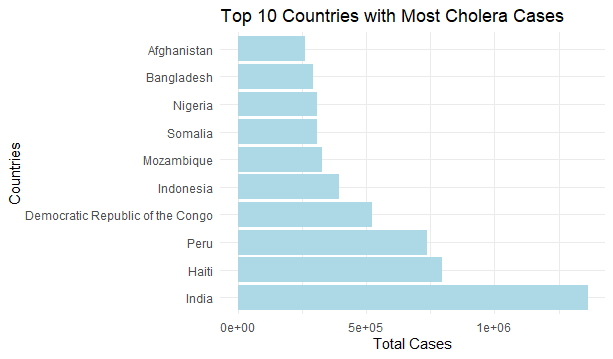
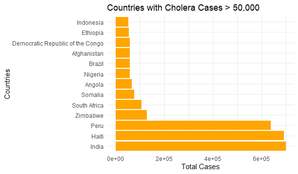
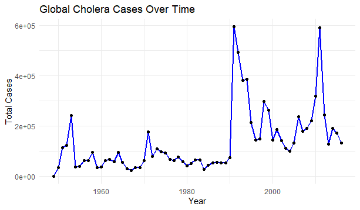
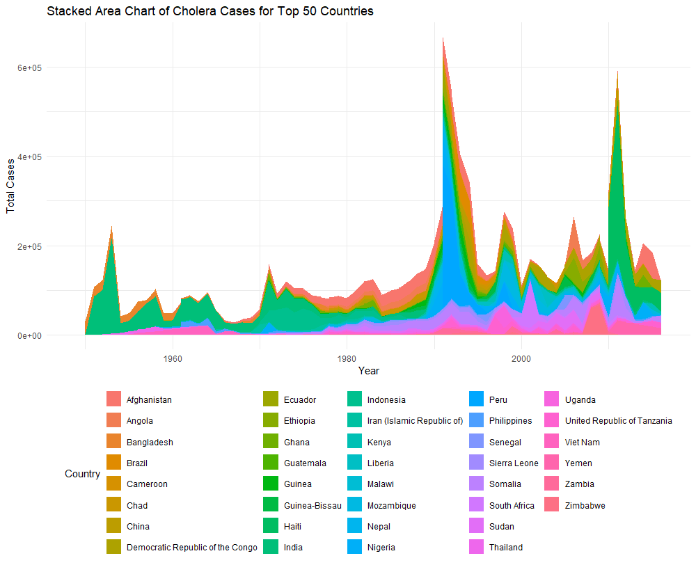
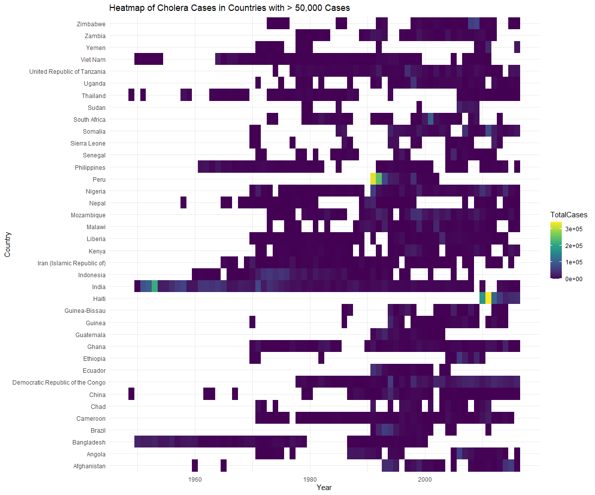
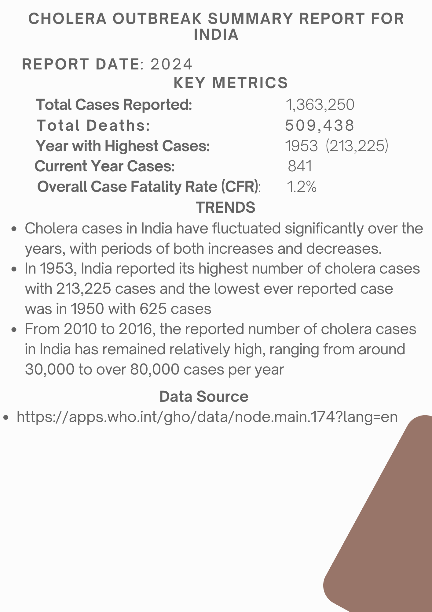

#Phase One
https://docs.google.com/document/d/1hN2SPxu2G8q1wZPW3VHFbvZDbmP9muoIWI0-OICjtnI/edit?usp=sharing

#phase two
 1: A graph of the Top 10 countries with most cholera casse: This bar chart shows the top 10 countries with the most cholera cases. India has the most
cases, followed by Haiti. The chart highlights the countries that are most affected by cholera
and could be used to inform public health efforts to address this issue. The data suggests that
cholera is a global problem that affects a wide range of countries

 
Figure 2: Countries with Cholera cases > 50,000
The graph depicts the countries with reported cholera cases exceeding 50,000. The countries
are arranged in ascending order based on their total case count. The graph serves as a stark
reminder of the ongoing threat posed by cholera. It highlights the countries most affected and
emphasizes the need for targeted interventions.

Figure 3: Global reflection of Cholera cases
The graph shows the global cholera cases over time. We can see that there are several
peaks in the number of cases, suggesting outbreaks of cholera. The most significant peak
occurred in the early 1990s, followed by another large peak in the late 1990s and early
2000s. The number of cases has generally been declining since the early 2000s.
This graph suggests that cholera is a cyclical disease, with outbreaks occurring
periodically

Figure 4: Stacked area chart of cholera cases for the top 50 countries
This stacked area chart shows the total number of cholera cases in the top 50 countries
from 1948 to 2016. there was a large peak in cholera cases in the early 1990s in Africa,
particularly in South Africa and Tanzania. In the late 1970s, India had a significant number of
cholera cases that decreased in the 1980s and increased again in the early 2000s. Overall,
this chart shows that cholera is a global disease and that there have been significant
fluctuations in the number of cases over time

Figure 5: Heatmap of cholera in countries which reported >50,000
The heatmap highlights the geographic regions most affected by cholera, particularly in SubSaharan Africa and parts of Asia. The map suggests that cholera cases have fluctuated over
time, with a peak in the 1970s followed by a decline in the 1980s. Countries, such as India and
Haiti, have consistently experienced high numbers of cholera cases throughout the period,
indicating possible underlying factors contributing to vulnerability

Source
https://apps.who.int/gho/data/node.main.174?lang=en

